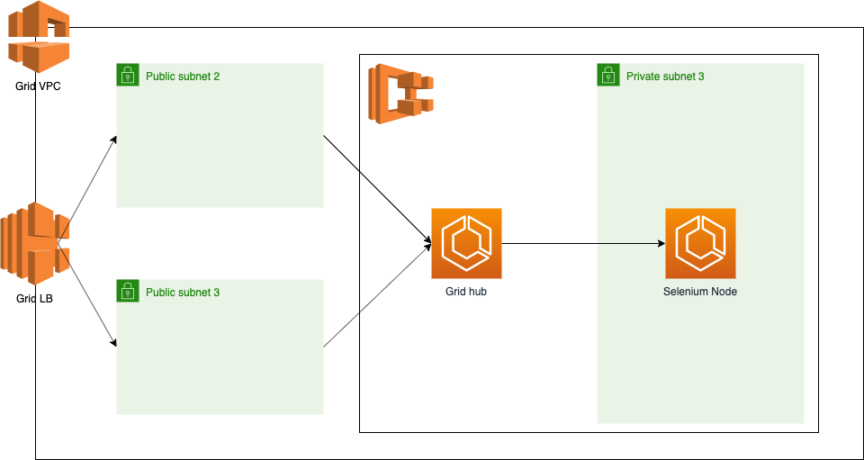

# Selenium Grid on Fargate

This project shows how to use [CloudFormation](https://aws.amazon.com/cloudformation/) and [ECS Fargate](https://aws.amazon.com/fargate/) to deploy a private [Selenium Grid](https://github.com/SeleniumHQ/docker-selenium) with a Chrome node.

## Why

In many companies, people write e2e / UI / regression tests for their web-apps. Some solutions like Browserstack or SauceLabs provide a "public" Selenium Grid for running your tests against different environments. However, such as any paid service, it comes with a cost. The more VM instances you need, the more expensive it becomes.

Assuming you have a small subscription to a service like Browserstack, you might be interested in reserving your VMs for your principal branches (`develop` or `master` or release branches following your branching strategy) and use a private Selenium Grid to run the tests for your other branches.

## How

The project is splitted into 5 stacks. Each stack takes care of a specific aspect of the infrastructure. The 5 domains are the following:
* Network: creates a VPC for the ECS Cluster with 3 subnets, 2 public ones and 1 private one. It creates also a internet gateway and NAT gateway for the subnets. It finally adds a internet-facing load-balancer to route traffic to the Selenium Hub.
* IAM: creates all the required IAM roles for the ECS, Cloudwatch and application auto-scaling.
* Serice discovery: creates a AWS ServiceDiscovery namespace and register the routes for the hub and the Chrome node.
* Selenium Grid: creates the ECS cluster and the tasks for the hub and Chrome as well as their services.
* Auto scalers: adds AWS Application auto-scaler the nodes to increase the amount of instances in case of heavy work load.

Illustration:



## Using it

### Infrastructure

Before anything else, make sure that you have a valid AWS account (more info [here](https://aws.amazon.com/free/)).

Create a user in IAM for programmatic usage and export the related `AWS_ACCESS_KEY_ID` and `AWS_SECRET_ACCESS_KEY` in your terminal.

Once it's done, run the following commands in the specified order:

```bash
$> aws cloudformation create-stack --stack-name grid-network --template-body="$(cat ./modules/network.yaml)" && aws cloudformation wait stack-update-complete --stack-name grid-network
$> aws cloudformation create-stack --stack-name grid-iam --template-body="$(cat ./modules/iam.yaml)" --capabilities CAPABILITY_IAM && aws cloudformation wait stack-update-complete --stack-name grid-iam
$> aws cloudformation create-stack --stack-name grid-service-discovery --template-body="$(cat ./modules/service-discovery.yaml)" && aws cloudformation wait stack-update-complete --stack-name grid-service-discovery
$> aws cloudformation create-stack --stack-name grid --template-body="$(cat ./modules/selenium-grid.yaml)" && aws cloudformation wait stack-update-complete --stack-name grid
$> aws cloudformation create-stack --stack-name grid-auto-scalers --template-body="$(cat ./modules/auto-scalers.yaml)" && aws cloudformation wait stack-update-complete --stack-name grid-auto-scalers
```

After all the deployments are made, go to your AWS console. Navigate to `EC2` then `LOAD BALANCING` then `Load Balancers`. Finally, click on the load-balancer named `SeleniumGrid`, you should see the DNS name in the screen below the list of load balancers. Save the DNS somewhere, it will be re-used for the example.

### Front-End

Now that our infrastructure is up and running, let's see what's needed for running our tests. For this example, we will use [Webdriver I/O](https://webdriver.io/) as shown in the example folder of this repository.

The first thing is to define our capabilities for Chrome. Here is an example:

```javascript
// wdio.conf.js
exports.config = {
// code before...
    capabilities: [{
        browserName: 'chrome',
        'goog:loggingPrefs': { browser: 'ALL' },
        'goog:chromeOptions': {
            args: ['--no-sandbox', '--disable-setuid-sandbox', '--headless', '--whitelisted-ips', '--disable-dev-shm-usage'],
        },
    }],
// ... code after
};
```

The options passed to the Chromedriver are required. The most important ones are:
* `--headless`: tells the Chromedriver to start in headless mode
* `--whitelisted-ips`: tells the Chromedriver to bind `0.0.0.0` instead of `127.0.0.1` because of how networking works within Fargate
* `--disable-dev-shm-usage`: tells the Chromedriver to not to look for extra resources in `/dev/shm` (aka _shared memory_)
* `--no-sandbox` and `--disable-setuid-sandbox`: very bad practice - could potentially be removed

When your configuration is ready, let `wdio` know where to look for the Selenium Hub. To do so, you can either use the following configuration (make sure to replace `randominteger` and `my-aws-region` by the correct values):

```javascript
// wdio.conf.js
exports.config = {
// code before...
    hostname: 'SeleniumGrid-randominteger.my-aws-region.elb.amazonaws.com',
    port: 4444, // default port
    path: '/wd/hub', // default path
// ... code after
};
```

or provide some options to the `wdio` cli as follows:

```bash
$> npx wdio --hostname SeleniumGrid-randominteger.my-aws-region.elb.amazonaws.com
```

A complete example can be found [here](./example).

## Yet to be done

* No support for Firefox
* No CloudWatch alerts defined
* Stacks could be nested
* Distribute the template through a (public?) S3 bucket
* Make a better diagram
* Add CI (GitHub Actions for the win)